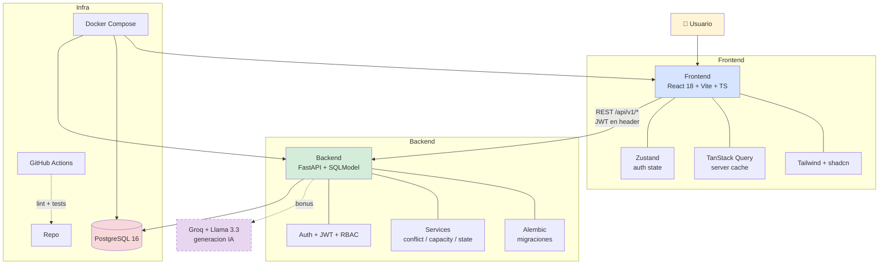

# Mis Eventos

> Plataforma web Full Stack para gestion de eventos
> Reto tecnico Serviinformacion 2026 - Senior Developer / Tech Lead Colombia

[](https://github.com/LadyGonzalezP/mis-eventos/actions/workflows/ci.yml)
[](./LICENSE)
[](https://www.python.org/downloads/release/python-3120/)
[](https://nodejs.org/)

---

## ¿Que hace?

**Mis Eventos** resuelve el problema de empresas que gestionan eventos de forma 100% manual (Excel, WhatsApp, papel). Centraliza inscripciones, sesiones, ponentes y asistentes en una sola plataforma web responsiva.

### Tres tipos de usuarios

| Rol | Que hace |
|---|---|
| 👤 **Asistente** | Busca eventos publicos, se inscribe (con control de cupo), ve sus eventos |
| 🎯 **Organizador** | Crea/edita sus eventos, programa sesiones con ponentes, ve inscritos |
| 🛡️ **Admin** | Supervisa el sistema completo, gestiona usuarios y resuelve conflictos |

### Caracteristicas clave

- ✅ **CRUD de eventos** con state machine (borrador → publicado → cancelado/finalizado)
- ✅ **Validacion automatica de conflictos de horario** por ponente
- ✅ **Control de cupos** por evento y por sesion
- ✅ **Busqueda + paginacion** con filtros (nombre, fecha, estado)
- ✅ **RBAC** con 3 roles via JWT
- ✅ **API versionada** desde dia 1 (`/api/v1/`)
- ✅ **OpenAPI/Swagger** auto-generado
- ✅ **Docker Compose** levanta todo con UN comando

---

## Arquitectura



**3 capas claras:** frontend solo presenta y mantiene UI state; backend concentra toda la logica de negocio y autorizacion; DB solo almacena. El bonus de IA (linea punteada) es opt-in.

Detalles completos en [`docs/ARCHITECTURE.md`](./docs/ARCHITECTURE.md).

---

## Quick start (un solo comando)

```bash
git clone https://github.com/LadyGonzalezP/mis-eventos.git
cd mis-eventos
docker compose up --build
```

Listo. Servicios disponibles:

| Servicio | URL |
|---|---|
| Frontend | http://localhost:5173 |
| Backend API | http://localhost:8000 |
| Swagger UI | http://localhost:8000/docs |
| Health check | http://localhost:8000/health |

---

## Setup local (sin Docker)

### Backend

```bash
cd backend
cp .env.example .env
# Editar .env con tu DATABASE_URL local

uv sync                          # Instala Python 3.12 + deps
uv run alembic upgrade head      # Aplica migraciones
uv run uvicorn mis_eventos.main:app --reload
```

Backend en http://localhost:8000

### Frontend

```bash
cd frontend
cp .env.example .env
npm install
npm run dev
```

Frontend en http://localhost:5173

---

## Tests

### Backend (cobertura > 50%)

```bash
cd backend
uv run pytest --cov=src --cov-report=term --cov-report=html
# Reporte HTML en backend/htmlcov/index.html
```

### Frontend

```bash
cd frontend
npm test                # Run all tests
npm run test:coverage   # Con cobertura
```

---

## Stack tecnico

| Capa | Tecnologia | Por que |
|---|---|---|
| Backend | FastAPI + SQLModel | OpenAPI auto + Pydantic + async |
| DB | PostgreSQL 16 | Pedido del reto + relaciones complejas |
| Migraciones | Alembic | Estandar, reversibles obligatorias |
| Frontend | React 18 + Vite + TS | Estandar 2026 + build rapido |
| UI | Tailwind + shadcn/ui | Componentes accesibles (Radix) |
| Estado | Zustand + TanStack Query | Separacion cliente/servidor |
| Auth | JWT + bcrypt | Stateless + estandar |
| Tests | pytest + Vitest | Estandares de cada ecosistema |
| Infra | Docker + Compose | Un comando, multi-plataforma |
| CI | GitHub Actions | Pedido del reto |

Justificacion detallada con trade-offs en [`docs/ARCHITECTURE.md`](./docs/ARCHITECTURE.md).

---

## Estructura del proyecto

```
mis-eventos/
├── backend/
│   ├── src/mis_eventos/
│   │   ├── api/            # Endpoints FastAPI (con tag OpenAPI)
│   │   ├── core/           # Config, seguridad, exceptions
│   │   ├── db/             # Engine y sesion SQLModel
│   │   ├── models/         # Entidades SQLModel (se agregan por slice)
│   │   ├── schemas/        # Pydantic DTOs (request/response)
│   │   ├── services/       # Logica de negocio (conflict, capacity, state)
│   │   └── main.py         # FastAPI app + router prefix /api/v1/
│   ├── migrations/         # Alembic - migraciones reversibles
│   ├── tests/              # pytest + httpx + SQLite en memoria
│   ├── Dockerfile
│   └── pyproject.toml
├── frontend/
│   ├── src/
│   │   ├── components/     # Componentes UI reusables
│   │   ├── pages/          # Pantallas (Login, EventList, etc.)
│   │   ├── stores/         # Zustand stores
│   │   ├── api/            # Cliente Axios + funciones por dominio
│   │   ├── hooks/          # Custom hooks
│   │   ├── lib/            # Utils (cn helper de shadcn)
│   │   ├── tests/          # Vitest + Testing Library
│   │   └── main.tsx        # React entry point
│   ├── Dockerfile          # Multi-stage build + nginx
│   ├── nginx.conf
│   └── package.json
├── docs/
│   ├── SPEC.md             # Especificacion funcional (fuente de verdad)
│   ├── ARCHITECTURE.md     # Decisiones tecnicas y trade-offs
│   └── AI_USAGE.md         # Uso de IA durante el desarrollo
├── tasks/
│   ├── plan.md             # Plan de implementacion por slices verticales
│   └── todo.md             # Checklist accionable de tareas
├── .github/workflows/
│   └── ci.yml              # Lint + tests en cada push y PR
├── docker-compose.yml
├── .gitignore
├── LICENSE
└── README.md
```

---

## Documentacion

- 📋 [`docs/SPEC.md`](./docs/SPEC.md) - Especificacion funcional completa (18 secciones)
- 🏛️ [`docs/ARCHITECTURE.md`](./docs/ARCHITECTURE.md) - Decisiones tecnicas y trade-offs
- 🤖 [`docs/AI_USAGE.md`](./docs/AI_USAGE.md) - Uso de IA en el desarrollo (se completa al final)
- 📅 [`tasks/plan.md`](./tasks/plan.md) - Plan de implementacion por slices
- ✅ [`tasks/todo.md`](./tasks/todo.md) - Checklist de tareas

---

## Variables de entorno

Ver [`backend/.env.example`](./backend/.env.example) y [`frontend/.env.example`](./frontend/.env.example).

### Backend

| Variable | Descripcion | Default |
|---|---|---|
| `DATABASE_URL` | URL de conexion a Postgres | postgresql://postgres:postgres@db:5432/mis_eventos |
| `JWT_SECRET` | Secret de firma JWT (≥ 32 bytes) | — (obligatorio) |
| `JWT_EXPIRATION_HOURS` | Duracion del token | 24 |
| `CORS_ORIGINS` | Whitelist de origenes (separados por coma) | http://localhost:5173 |
| `LOG_LEVEL` | Nivel de logs | INFO |
| `APP_VERSION` | Version de la app | 0.1.0 |
| `GROQ_API_KEY` | API key para IA (bonus) | — |

### Frontend

| Variable | Descripcion | Default |
|---|---|---|
| `VITE_API_BASE_URL` | URL del backend | http://localhost:8000 |

---

## Estado del proyecto

### ✅ Slice 0 — Foundations (completado)
- [x] Estructura del repo + git inicializado
- [x] Backend skeleton: FastAPI + SQLModel + Alembic + `/health`
- [x] API versionada `/api/v1/` + formato de error estandar
- [x] Frontend skeleton: React 18 + Vite + TS + Tailwind + shadcn
- [x] Docker Compose con Postgres + backend
- [x] CI con GitHub Actions
- [x] Docs iniciales (SPEC + ARCHITECTURE + plan + todo)

### ⏳ Por hacer (slices 1-7)
- [ ] Auth + RBAC con 3 roles
- [ ] CRUD Eventos con state machine
- [ ] Sesiones + ponentes + validacion de conflictos
- [ ] Inscripciones + control de cupo
- [ ] Tests > 50% backend + Vitest frontend
- [ ] Logs JSON + request_id + headers de seguridad

### 🎁 Bonus (slice 8, opcional)
- [ ] IA generadora de descripciones (Groq + Llama 3.3)
- [ ] Deploy en nube (Fly.io o Railway)

---

## Licencia

[MIT](./LICENSE) - Copyright (c) 2026 Lady Katherine Gonzalez

---

**Autora:** [Lady Katherine Gonzalez](https://github.com/LadyGonzalezP)
**Email:** lady.kgonzalez@gmail.com
**Proyecto:** Reto tecnico Serviinformacion - Senior Developer / Tech Lead Colombia 2026
