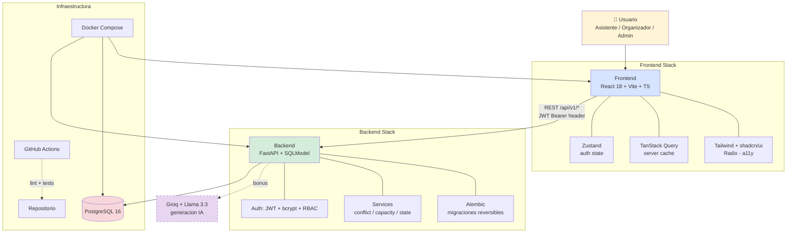

# ARCHITECTURE — Mis Eventos

> Decisiones tecnicas, trade-offs y diagrama del sistema.
> Documento vivo - se actualiza con cada decision relevante durante el desarrollo.

---

## 1. Vista del sistema



**Lectura del diagrama:** el sistema sigue un patron **3 capas clasico** (frontend, backend, DB) con responsabilidades claras: el frontend solo presenta y mantiene estado UI; el backend concentra **toda** la logica de negocio y autorizacion; la DB solo almacena. El bonus de IA (linea punteada) es opt-in - el sistema funciona sin el.

**Por que esta separacion:** un evaluador/auditor puede correr **solo el backend** para verificar la API; un disenador puede iterar **solo el frontend** sin tocar Python; un DBA puede revisar **solo el schema**. Cada capa es testeable de forma aislada.

---

## 2. Stack tecnico

| Capa | Tecnologia | Version | Por que |
|---|---|---|---|
| Lenguaje backend | Python | 3.12 | Pedido del reto + type hints maduros |
| Framework backend | FastAPI | 0.115+ | OpenAPI auto + async + Pydantic |
| ORM | SQLModel | 0.0.22+ | Modelos = entidad + schema en una sola clase |
| Migraciones | Alembic | 1.13+ | Estandar SQLAlchemy + reversibles obligatorias |
| Base de datos | PostgreSQL | 16-alpine | Pedido del reto + relaciones complejas |
| Auth | python-jose + passlib[bcrypt] | latest | JWT estandar + hashing seguro |
| Tests backend | pytest + httpx | 8+ / 0.27+ | Estandar Python + cliente async |
| Lint backend | Ruff | 0.7+ | 100x mas rapido que flake8/black |
| Package manager | uv | 0.11+ | 100x mas rapido que pip |
| Lenguaje frontend | TypeScript | 6.x | Tipado estricto - esperado en senior |
| Framework frontend | React | 18 | Estandar industria 2026 |
| Build tool | Vite | 8 | Build rapido + HMR instantaneo |
| UI | Tailwind 3.4 + shadcn/ui | latest | Componentes accesibles pre-armados |
| Estado cliente | Zustand | 5 | API minimal + sin boilerplate |
| Estado servidor | TanStack Query | 5 | Cache + refetch + loading auto |
| HTTP client | Axios | 1 | Interceptors para JWT |
| Tests frontend | Vitest + Testing Library | 2 / 16 | Compatible con Vite + accesible |
| Containers | Docker + Compose | 25+ | Pedido del reto |
| CI | GitHub Actions | — | Pedido del reto |
| IA (bonus) | Groq + Llama 3.3 | latest | Free tier amplio |
| Deploy (bonus) | Fly.io o Railway | — | $0-5/mes + simple |

---

## 3. Decisiones tecnicas (trade-offs)

### Decision 1 — FastAPI sobre Django o Flask

**Que elegimos:** FastAPI.

**Alternativas evaluadas:**
- **Django + DRF**: framework completo, admin built-in, ORM Django.
- **Flask + extensions**: minimalista, total flexibilidad, requiere mas decisiones manuales.

**Por que FastAPI:**
1. **OpenAPI auto-generado** desde el codigo - cumple un requisito del reto sin esfuerzo.
2. **Pydantic v2 integrado** - validacion + serializacion en la misma clase.
3. **Async nativo** - el evaluador puede ver patron moderno.
4. **Menos boilerplate** que Django para una API REST sin admin web.
5. **Yo (Lady) ya conozco FastAPI por LexAudit** - tiempo de ramp-up cero.

**Trade-off:** menos bateria-incluida que Django (no hay admin panel out-of-the-box, no hay forms framework). **A cambio:** API mas limpia, mejor docs auto-generadas, mejor performance, y un sistema mas "transparente" - facil de mostrar como funciona en una entrevista.

**Frase ancla:** *"OpenAPI auto + Pydantic + async, sin esfuerzo."*

---

### Decision 2 — SQLModel sobre SQLAlchemy puro

**Que elegimos:** SQLModel.

**Alternativas evaluadas:**
- **SQLAlchemy + Pydantic separados**: maximo control, dos clases por entidad (modelo DB + schema API).
- **Django ORM**: descartado al elegir FastAPI.
- **SQLModel**: combina SQLAlchemy 2 + Pydantic v2 en una sola clase.

**Por que SQLModel:**
1. **Una sola clase = modelo DB + schema API** - menos duplicacion de codigo.
2. **Mismo creador que FastAPI** - integracion natural.
3. **Type hints estrictos** - mejor experiencia con autocompletado.
4. **Migraciones via Alembic** - el estandar maduro.

**Trade-off:** SQLModel es menos maduro que SQLAlchemy puro (lanzado 2021, vs SQLAlchemy 2006). Algunas features avanzadas requieren bajar a SQLAlchemy explicitamente. **A cambio:** menos codigo, mas legible, mas rapido de iterar - critico para un MVP de 5 dias.

**Frase ancla:** *"Una clase = entidad y schema. Menos boilerplate, mas legibilidad."*

---

## 4. Patrones aplicados

### 4.1 API versionada desde dia 1

Todos los endpoints de negocio estan bajo **`/api/v1/`**. Endpoints de sistema (`/health`, `/docs`, `/openapi.json`) no llevan prefijo.

**Beneficio:** podemos lanzar `/api/v2/` en el futuro sin romper clientes.

### 4.2 Formato estandar de respuesta de error

Toda respuesta de error sigue el formato:

```json
{
  "error": "machine_readable_code",
  "detail": "Mensaje legible en espanol",
  "context": {}
}
```

Implementacion en `core/exceptions.py` con clase base `AppError` + custom exception handlers de FastAPI.

### 4.3 Migraciones reversibles obligatorias

Toda migracion Alembic debe tener un `downgrade()` valido y testeado con `alembic downgrade -1`.

**Beneficio:** rollback seguro en produccion ante un mal deploy.

### 4.4 RBAC por dependency injection

Permisos enforced con dependencies de FastAPI:

```python
@router.post("/events", dependencies=[Depends(require_role("organizador", "admin"))])
def create_event(...): ...
```

**Beneficio:** la autorizacion es declarativa, esta junto al endpoint, y se ve clara en el OpenAPI generado.

---

### Decision 3 — State machine como servicio puro (Slice 2)

**Que elegimos:** Logica del state machine en `services/event_state.py` como funcion pura `can_transition(current, target) -> bool`, sin DB ni IO.

**Alternativas evaluadas:**
- **Status como string libre en el modelo** sin validacion → todos los `set status` valdrian.
- **Logica en cada endpoint** → duplicacion entre publish/cancel/finalize.

**Trade-off:** un modulo mas a mantener, **pero** testeable sin DB (los 20 tests de `test_event_state.py` corren en milisegundos), reutilizable desde cualquier caller, y defendible en code review (lectura clara de las transiciones validas).

**Frase ancla:** *"Logica pura, testeable, defendible."*

---

### Decision 4 — Validacion de conflictos en servicio (Slice 3)

**Que elegimos:** Algoritmo de interval overlap en `services/conflict_validator.py` (funcion `find_conflict`), no en constraint de DB.

**Alternativas evaluadas:**
- **PostgreSQL EXCLUDE constraint con tstzrange GIST** → mas eficiente para corpus enormes, pero no permite mensaje legible al usuario.
- **Validacion en frontend** → trivialmente bypasseable.
- **LLM-as-judge** → segunda fuente de alucinacion, sobreingenierizado.

**Trade-off:** O(n) sobre las sesiones del ponente (no escala a millones), **pero** permite devolver HTTP 409 con detalle del choque (`session_id`, `event_name`, `start_time`, `end_time`) para que la UI muestre un mensaje accionable.

Para corpus grandes la mejora futura es indice GIST de Postgres - documentado en SPEC como "mejora futura explicita".

**Frase ancla:** *"Mensaje legible al usuario - no podria con un constraint exclusivamente."*

---

### Decision 5 — Conteo de cupos en cada check (Slice 4)

**Que elegimos:** Query `COUNT(*)` en cada chequeo de cupos (`services/capacity.count_registrations`).

**Alternativas evaluadas:**
- **Columna materializada `registered_count` en Event** → mantener consistencia es complejo (triggers, retry, race conditions).
- **Cache en Redis** → otra dependencia.

**Trade-off:** un query extra por inscripcion. **A cambio:** zero estado duplicado, zero race conditions, zero codigo para mantener sincronizado. Para el MVP con < 10K eventos, el costo del COUNT es despreciable.

Para alta escala, la mejora futura es materializar el contador con triggers de Postgres.

**Frase ancla:** *"Estado duplicado = bug duplicado. Single source of truth."*

---

### Decision 6 — Bcrypt directo sobre passlib

**Que elegimos:** `import bcrypt` y usarlo directo en `core/security.py`.

**Alternativas evaluadas:**
- **passlib[bcrypt]** (el estandar tradicional) → falla con `bcrypt 4.x+` porque passlib no esta actualizado.

**Trade-off:** menos dependencias intermediarias. **Esta validado en la practica:** el primer intento con passlib me dio `AttributeError: module 'bcrypt' has no attribute '__about__'` y tuve que migrar.

**Frase ancla:** *"Una capa menos. Validado por incidente."*

---

## 6. Decisiones pendientes (slice 8 - bonus)

- [ ] **Decision 7** — Provider-agnostic LLM (Slice 8 si hacemos bonus de IA)
- [ ] **Decision 8** — Deploy: Fly.io vs Railway (Slice 8 si hacemos bonus de deploy)

---

## 6. Observabilidad

(Se completa en Slice 5)

- Logs JSON estructurados con niveles `info | warn | error`
- Endpoint `/health` con check de DB
- ⭐ Bonus: `request_id` UUID por peticion propagado en logs y headers

---

## 7. Seguridad

(Se completa en Slice 5)

| OWASP | Cobertura |
|---|---|
| A01 Broken Access Control | RBAC con 3 roles + `require_role()` |
| A02 Crypto Failures | bcrypt cost ≥ 12 + JWT HS256 secret ≥ 32 bytes |
| A03 Injection | SQLModel parameteriza (sin SQL crudo) + Pydantic valida |
| A05 Misconfiguration | `.env` gitignored + CORS restrictivo |
| A07 Auth Failures | JWT expiration + password policy |
| A09 Logging Failures | Logs JSON + stack traces |

Ver SPEC SS 13 para la tabla OWASP Top 10 completa.

---

## 8. Lectura del diseno

> **Mis Eventos no es el sistema mas sofisticado posible - es el mas defendible.**
>
> Cada decision tecnica esta alineada con el **principio guia**: priorizar trazabilidad, verificabilidad y estabilidad de demo sobre cobertura amplia.

---

## 9. Referencias

- [SPEC.md](./SPEC.md) - Especificacion funcional
- [tasks/plan.md](../tasks/plan.md) - Plan de implementacion por slices
- [tasks/todo.md](../tasks/todo.md) - Checklist de tareas

---

**Version:** 1.0 (initial) - se completa en Slice 7 con 4 decisiones mas + tabla OWASP completa
**Fecha:** 2026-05-23
**Autora:** Lady Katherine Gonzalez
