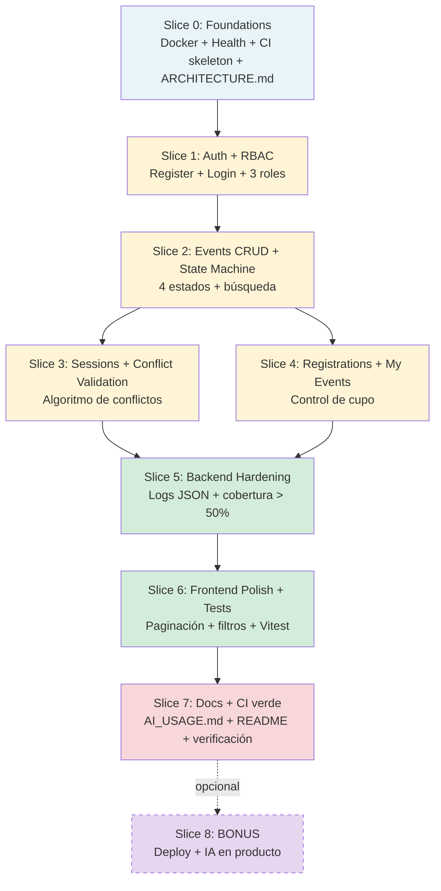
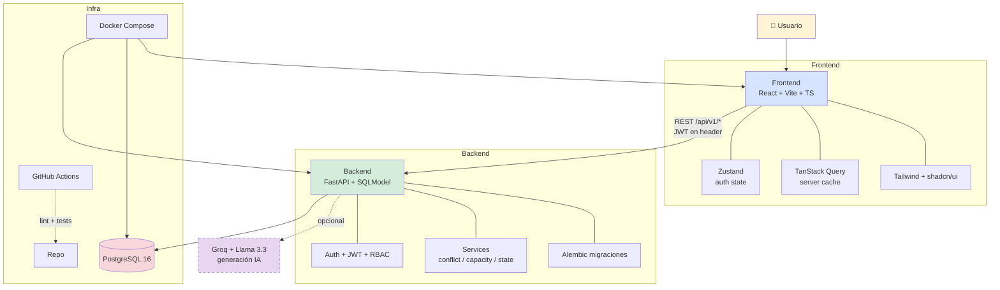

# PLAN — Mis Eventos

> **Plan de implementación ejecutable** · Reto Serviinformación 2026
> Stack: FastAPI + SQLModel + PostgreSQL · React 18 + Vite + TS + Tailwind + shadcn
> Spec base: [`docs/SPEC.md`](../docs/SPEC.md) · Plazo: 5 días hábiles (deadline jueves 28-may-2026)

---

## 0. Filosofía del plan

**Slices verticales, no capas horizontales.** Cada slice entrega una funcionalidad **end-to-end** (backend + frontend + tests) que un usuario puede ejecutar. Esto significa que al final de cada día tenemos algo **funcional** que se puede demostrar, no media docena de "componentes a medias".

**Checkpoints duros entre slices.** No se pasa al siguiente slice hasta que el anterior pasa su verificación.

**Documentación + tests son ciudadanos de primera.** Cada slice incluye explícitamente: tests automatizados, actualización de `ARCHITECTURE.md` si hay decisión nueva, y notas para `README.md` / `AI_USAGE.md`.

**Cero sorpresas durante el build.** Todo lo que vamos a construir está pre-definido en SPEC, plan y ARCHITECTURE. Si algo no está documentado antes de empezar a codear, lo agregamos a la spec primero — no lo improvisamos.

---

## 0.1 Cobertura SPEC ↔ Plan (matriz garantía)

Cada sección del SPEC tiene un slice del plan donde se implementa. **Si esta matriz no está completa, el plan tiene un hueco.**

| SPEC § | Requisito | Slice que lo implementa | Verificación |
|---|---|---|---|
| §2 Alcance MVP | Funcionalidades obligatorias | S1-S6 | CP1-CP6 |
| §2 Alcance Bonus | RBAC + CORS + request_id + IA + deploy | S1 (RBAC) + S5 + S8 | CP1, CP5, CP8 |
| §3 RBAC 3 roles | Asistente/Organizador/Admin | S1 (`require_role()` dep) | `test_rbac_*` |
| §4.1 Auth | JWT + bcrypt + 24h | S1 | `test_auth.py` |
| §4.2 Eventos + state machine | 4 estados + transiciones | S2 (servicio puro) | `test_event_state.py` |
| §4.3 Sesiones + ponentes | CRUD + capacity | S3 | `test_sessions.py` |
| §4.4 Conflictos horario | Algoritmo determinista | S3 ⭐ | 8+ tests de `test_conflict_validator.py` |
| §4.5 Inscripciones + cupo | Registro + duplicados + cupo | S4 | `test_registrations.py` |
| §4.6 IA generación descripción | Bonus Groq+Llama | S8 | manual + mock en tests |
| §5 Modelo de datos | 5 entidades + relaciones + cascadas | S1-S4 (incremental) | Migraciones Alembic reversibles |
| §6 Convención `/api/v1/` | Prefijo desde día 1 | **S0** (router prefix) | `curl /api/v1/events` |
| §6 Formato error estándar | `{error, detail, context}` | **S0** (exception handlers) | Tests verifican estructura |
| §6 OpenAPI tags | 7 grupos en Swagger | **S0** (al definir routers) | Visual en `/docs` |
| §7 Pantallas frontend | 9 pantallas listadas | S1-S7 | Verificación visual + Vitest |
| §8 Stack | Lockeado en SPEC | S0 (deps) | `uv.lock` + `package-lock.json` |
| §9 Comandos | `docker compose up`, etc. | S0 + README | Smoke test desde clon limpio |
| §10 Estructura carpetas | Definida en SPEC | S0 | Visual + import paths |
| §11 Estilo código | Ruff + ESLint + Conventional Commits + a11y | Transversal | CI gates |
| §12 Testing strategy | 4 niveles | Cada slice | CP de cada slice |
| §13 Seguridad | bcrypt, JWT, validación, CORS, headers | S1 + **S5** | Tests + revisión manual |
| §13 OWASP Top 10 | 10 riesgos cubiertos | Transversal + S5 | Tabla en ARCHITECTURE.md |
| §13 Observabilidad | Logs JSON + `/health` + `request_id` | **S0** (`/health` v1) + **S5** (full) | `curl /health` + logs |
| §14 Criterios aceptación | 10 criterios checklist | CP7 (verificación final) | Manual end-to-end |
| §15 Boundaries ALWAYS/ASK/NEVER | Reglas del juego | Transversal | Code review + commits |
| §16 Plan 5 días | Calendario | Este documento | — |
| §17 Riesgos | 6 riesgos + mitigación | Transversal + S0 | — |
| §18 Referencias | Links a otros docs | Este documento + README | — |

**Si en algún momento durante el build aparece un requisito que NO está en esta matriz, paramos y actualizamos la spec antes de continuar.**

---

## 1. Dependency graph



**Slices en paralelo posibles:** S3 y S4 (después de S2). Todo lo demás es secuencial.

---

## 2. Calendario por slice

| Slice | Día / Fecha | Foco | Tarea raíz |
|---|---|---|---|
| **S0** | Vie 22-may (tarde) | Foundations | #29 |
| **S1** | Lun 25-may (AM) | Auth + RBAC | #30 |
| **S2** | Lun 25-may (PM) | Events CRUD + state machine | #31 |
| **S3** | Mar 26-may (AM) | Sessions + conflicts | #32 |
| **S4** | Mar 26-may (PM) | Registrations + My Events | #32 |
| **S5** | Mié 27-may (AM) | Backend hardening | #33 |
| **S6** | Mié 27-may (PM) + Jue 28-may (AM) | Frontend completo + Vitest | #34 + #35 |
| **S7** | Jue 28-may (PM) | Docs + CI verde + verificación | #36 |
| **S8** | Vie 29-may (buffer) | Bonus deploy + IA | #37 |

**Buffer fin de semana (sáb 23 / dom 24):** disponible si querés adelantar S0 o S1.

---

## 3. SLICES — detalle vertical

### 🏗️ SLICE 0 — Foundations

**Objetivo:** `docker compose up` levanta DB + backend (`/health` responde 200) desde un clon limpio.

**Scope:**
- Estructura de carpetas (`backend/`, `frontend/`, `docs/`, `tasks/`, `.github/workflows/`)
- `pyproject.toml` con FastAPI + SQLModel + Alembic + pytest + ruff
- Dockerfile backend + Dockerfile frontend skeleton
- `docker-compose.yml` con postgres + backend
- `.env.example` con todas las variables (SPEC §13)
- `main.py` con FastAPI app + endpoint `/health` que pingea la DB
- **Router prefix `/api/v1/`** configurado en `main.py` (SPEC §6)
- **Custom exception handlers** en `core/exceptions.py` con formato `{error, detail, context}` (SPEC §6)
- **OpenAPI tags** definidos (`auth`, `events`, `sessions`, `speakers`, `registrations`, `users`, `system`) (SPEC §6)
- Alembic configurado (sin migraciones aún)
- CI skeleton (`.github/workflows/ci.yml`): solo lint + estructura, aún sin tests reales
- `ARCHITECTURE.md` v1 con: diagrama Mermaid + stack justificado + 2 trade-offs iniciales
- `README.md` v1 con setup mínimo + diagrama Mermaid básico (versión final en S7)

**Acceptance criteria:**
- [ ] `git clone` + `docker compose up` levanta sin errores
- [ ] `curl http://localhost:8000/health` devuelve `{"status":"ok","db":"ok","version":"0.1.0"}`
- [ ] `uv run pytest` arranca (puede no haber tests aún, pero el comando existe)
- [ ] CI corre en push y falla limpio si rompemos algo
- [ ] `ARCHITECTURE.md` tiene diagrama Mermaid y al menos 2 decisiones documentadas

**Verification:**
```bash
docker compose down -v
docker compose up --build
sleep 5
curl -s http://localhost:8000/health | grep '"db":"ok"' && echo "✅ CP0 passed"
```

**Riesgos:** Docker en Windows puede tardar en levantar la primera vez. Mitigación: usar imágenes oficiales `python:3.12-slim` y `postgres:16-alpine`.

---

### 🔐 SLICE 1 — Auth + RBAC

**Objetivo:** un usuario puede registrarse desde el frontend, recibir su JWT, y ver una página protegida según su rol.

**Scope backend:**
- `User` model (SQLModel) con `role: Literal["asistente","organizador","admin"]`
- Migración Alembic inicial con tabla `user`
- `POST /auth/register` con validación (email único, password ≥ 8 chars + 1 número)
- `POST /auth/login` que devuelve JWT
- `core/security.py` con: hash bcrypt, encode/decode JWT, dependencies `get_current_user`, `require_role(*roles)`
- Seed script para crear el primer Admin

**Scope frontend:**
- React + Vite + TS + Tailwind + shadcn instalados
- `authStore` (Zustand) con `user`, `token`, `login()`, `logout()`
- Página `/login` y `/register` con formularios
- Axios interceptor que adjunta `Authorization: Bearer <token>`
- Router con `<ProtectedRoute role="organizador">`
- Página `/dashboard` placeholder protegida

**Scope tests:**
- `test_auth.py`: register OK, register email duplicado, password corto, login OK, login inválido, JWT con expiración correcta
- Test de RBAC dependency: usuario sin rol intenta acceso → 403

**Acceptance criteria:**
- [ ] Usuario nuevo puede registrarse como Asistente u Organizador desde el frontend
- [ ] El JWT recibido se guarda en localStorage y se manda en headers
- [ ] Un Asistente que intenta crear evento recibe 403 (al menos en backend)
- [ ] Tests pasan: `uv run pytest tests/test_auth.py -v`
- [ ] CI sigue verde

**Verification:**
```bash
# Backend
uv run pytest tests/test_auth.py -v
# Frontend manual
# 1. Abrir http://localhost:5173/register
# 2. Crear cuenta como Organizador
# 3. Verificar redirect a /dashboard
# 4. F12 → Application → localStorage tiene "token"
```

**Documentación a actualizar:**
- `ARCHITECTURE.md` § Decisiones: agregar trade-off de **JWT vs sesiones server-side**
- `AI_USAGE.md`: anotar primera sugerencia IA aceptada y por qué (mientras se trabaja)

---

### 📅 SLICE 2 — Events CRUD + State Machine

**Objetivo:** un Organizador puede crear un evento, editarlo, publicarlo y cancelarlo desde la UI. Un Asistente puede ver los eventos publicados.

**Scope backend:**
- `Event` model con `status: Literal[...]`, `organizer_id` FK, fechas, capacidad
- Migración Alembic con tabla `event`
- `POST /events` (crea en `borrador`, requiere Organizador/Admin)
- `GET /events` con filtros `q`, `status`, `date_from`, `date_to`, `page`, `limit`
- `GET /events/{id}` público
- `PATCH /events/{id}` (dueño o Admin, no editable si finalizado)
- `DELETE /events/{id}` (solo si borrador)
- `POST /events/{id}/publish` (valida que tenga ≥ 1 sesión — se completa en S3)
- `POST /events/{id}/cancel`
- `services/event_state.py`: state machine pura con tests

**Scope frontend:**
- Página `/events` con listado paginado + filtros (nombre, fecha, estado)
- Página `/events/:id` con detalle del evento
- Página `/events/new` con formulario (solo Organizador/Admin)
- Página `/events/:id/edit`
- Botones de "Publicar" / "Cancelar" según estado actual
- Hook `useEvents()` con TanStack Query
- Toast de feedback (éxito/error)

**Scope tests:**
- `test_events.py`: CRUD básico, búsqueda, paginación
- `test_event_state.py`: state machine — transiciones válidas e inválidas (8 casos)
- Test de permisos: Asistente intenta editar evento → 403

**Acceptance criteria:**
- [ ] Organizador puede crear, editar y eliminar SUS eventos
- [ ] Asistente NO puede ver eventos en borrador
- [ ] Búsqueda `?q=conf` filtra por nombre parcial
- [ ] Paginación funciona (page=1, page=2)
- [ ] State machine rechaza transiciones inválidas (`finalizado` → `borrador` falla con 400)
- [ ] Tests pasan con cobertura del módulo events > 70%

**Verification:**
```bash
uv run pytest tests/test_events.py tests/test_event_state.py -v --cov=src/mis_eventos/services/event_state.py
```

**Documentación a actualizar:**
- `ARCHITECTURE.md` § Decisiones: agregar trade-off de **state machine en servicio vs status como string libre**

---

### 🎤 SLICE 3 — Sessions + Conflict Validation ⭐

**Objetivo:** un Organizador puede agregar sesiones a un evento con ponente, y el sistema rechaza conflictos de horario. **Este es el algoritmo más crítico del backend.**

**Scope backend:**
- `Speaker` model (id, name, bio, email)
- `Session` model con FK a Event y Speaker (nullable)
- Migraciones Alembic para `speaker` y `session`
- `services/conflict_validator.py` con la lógica exhaustivamente testeada (ver SPEC §4.4)
- `POST /events/{event_id}/sessions` que llama al validator
- `PATCH /sessions/{id}` con re-validación (excluye la propia)
- CRUD básico de `/speakers`
- Validación de rango: session dentro del rango del event padre
- Validación de capacity: session.capacity ≤ event.capacity

**Scope frontend:**
- Subpágina "Sesiones" dentro del formulario de evento
- Modal/form para crear/editar sesión
- Selector de ponente (autocomplete o dropdown)
- Manejo de error 409 con mensaje legible: *"Choque con sesión 'X' del evento 'Y' (10:00–11:30)"*

**Scope tests:** ⭐ **el bloque más importante**
- `test_conflict_validator.py` con AL MENOS 6 casos del SPEC §4.4:
  1. ✅ Sesiones que no se solapan → pasa
  2. ✅ Sesiones consecutivas (end_time == start_time) → pasa
  3. ❌ Solapamiento total → falla
  4. ❌ Solapamiento parcial (inicio o fin solo) → falla
  5. ❌ Sesión nueva contenida en otra → falla
  6. ✅ Sesiones simultáneas con ponentes distintos → pasa
- Test bonus: editar sesión sin cambiar speaker_id → no falla con sigo mismo

**Acceptance criteria:**
- [ ] Los 6 tests de conflictos pasan
- [ ] Crear sesión con ponente ya ocupado → HTTP 409 con `conflict_with` payload
- [ ] La UI muestra el detalle del choque en español
- [ ] Speaker eliminado deja sus sesiones con `speaker_id = NULL` (no rompen)
- [ ] Una sesión fuera del rango del evento → HTTP 400

**Verification:**
```bash
uv run pytest tests/test_conflict_validator.py -v
# Espera: 6 passed (mínimo)
```

**Documentación a actualizar:**
- `ARCHITECTURE.md` § Decisiones: trade-off de **validación en servicio vs constraint en DB**
- `AI_USAGE.md`: este puede ser el ejemplo de "bug que la IA no detectó" — si Claude propone sólo 3 casos de test y vos agregás los otros 3, eso es **oro** para AI_USAGE.md

---

### 🎟️ SLICE 4 — Registrations + My Events

**Objetivo:** un Asistente puede inscribirse a un evento publicado y ver "mis eventos" desde la UI.

**Scope backend:**
- `Registration` model con UNIQUE(event_id, user_id)
- Migración Alembic
- `POST /events/{id}/register`: valida `status=publicado`, cupo > 0, no duplicado
- `DELETE /events/{id}/register`: cancela la propia
- `GET /me/registrations`: lista los eventos del usuario actual con su estado
- `services/capacity.py`: cuenta inscritos vs capacity, expone `available_slots(event_id)`

**Scope frontend:**
- Botón "Inscribirme" en `/events/:id` (solo si autenticado y hay cupo)
- Estado dinámico: "Inscrito ✓" si ya está, "Sin cupo" si no
- Página `/me/events`:
  - Asistente: eventos donde está inscrito
  - Organizador: eventos que organiza (con # inscritos)
- Botón de cancelar inscripción

**Scope tests:**
- `test_registrations.py`:
  - Inscribirse a evento publicado con cupo → OK
  - Inscribirse a evento `borrador` → 400
  - Inscribirse 2 veces al mismo evento → 409
  - Inscribirse a evento lleno → 409
  - Cancelar inscripción propia → OK
  - Cancelar inscripción ajena → 403

**Acceptance criteria:**
- [ ] Asistente puede inscribirse desde la UI con un click
- [ ] Tests de cupo y duplicados pasan
- [ ] `/me/registrations` muestra los eventos correctos
- [ ] El contador de inscritos en evento se actualiza al inscribirse

**Verification:**
```bash
uv run pytest tests/test_registrations.py -v
```

**Documentación a actualizar:**
- `ARCHITECTURE.md` § Decisiones: trade-off de **conteo de cupos: query en cada check vs columna materializada**

---

### 🛡️ SLICE 5 — Backend Hardening

**Objetivo:** el backend está listo para producción — logs estructurados, cobertura > 50%, seguridad y observabilidad sólidas.

**Scope:**
- `core/logging.py` con logger JSON estructurado (usando `structlog` o `python-json-logger`)
- Middleware FastAPI que loggea cada request: `method`, `path`, `status`, `duration_ms`, `user_id`, `request_id`
- ⭐ Bonus: middleware de `request_id` (UUID por request, propagado en headers de respuesta)
- ⭐ Bonus: CORS configurado restrictivo (whitelist de orígenes desde `.env`)
- ⭐ Bonus: headers HTTP de seguridad (`X-Content-Type-Options`, `X-Frame-Options`, `Strict-Transport-Security`)
- `/health` mejorado: chequea DB con `SELECT 1`, devuelve versión leída de `pyproject.toml`
- Revisión de todos los endpoints: validación Pydantic, códigos HTTP correctos, manejo de error consistente
- Tests adicionales para llegar a > 50% cobertura

**Acceptance criteria:**
- [ ] Cada request loggea en JSON con todos los campos requeridos
- [ ] `/health` devuelve `{"status":"ok","db":"ok","version":"x.y.z","timestamp":"..."}`
- [ ] `uv run pytest --cov=src --cov-fail-under=50` pasa
- [ ] No hay endpoint sin validación Pydantic en su body
- [ ] No hay `except Exception: pass` en el código

**Verification:**
```bash
# Cobertura
uv run pytest --cov=src --cov-report=term --cov-fail-under=50

# Logs estructurados
curl -s http://localhost:8000/events
# Revisar logs del container — deben ser JSON parseable

# Health
curl -s http://localhost:8000/health | jq .
```

**Documentación a actualizar:**
- `ARCHITECTURE.md` § Observabilidad: documentar formato de logs y request_id

---

### 🎨 SLICE 6 — Frontend Polish + Tests

**Objetivo:** frontend pulido, responsivo, con tests de componentes clave.

**Scope:**
- Paginación visual (Prev/Next + page numbers)
- Filtros en UI: campo de búsqueda, dropdowns de estado y fecha
- Toast/snackbar consistente (success + error) en todas las acciones
- Loading states con skeletons (shadcn `<Skeleton>`)
- Confirmación modal antes de eliminar/cancelar
- Verificación responsive: 320px → 768px → 1024px → 1440px
- 404 / 403 pages

**Scope tests (Vitest + Testing Library):**
- `EventCard.test.tsx`: renderiza nombre, fecha, cupos disponibles
- `EventForm.test.tsx`: validación de campos, submit deshabilitado mientras envía
- `LoginForm.test.tsx`: muestra error con credenciales inválidas
- Hook `useEvents.test.tsx`: maneja loading y error states

**Acceptance criteria:**
- [ ] Listado se ve bien en móvil (320px) y desktop (1440px)
- [ ] Todos los formularios muestran errores de validación con texto en español
- [ ] Toast aparece después de cada acción (crear, editar, eliminar, inscribirse)
- [ ] Tests Vitest pasan: `npm test`
- [ ] No hay `any` ni `// @ts-ignore` no justificados

**Verification:**
```bash
cd frontend
npm run lint
npm test
npm run build  # smoke test del build
```

---

### 📚 SLICE 7 — Docs + CI verde + Verificación final

**Objetivo:** la entrega está lista. CI verde, docs completas, smoke test desde clon limpio pasa.

**Scope `ARCHITECTURE.md` final:**
- Diagrama Mermaid completo (sistema entero)
- Stack justificado con tabla
- **6 trade-offs** documentados con formato:
  ```
  ### Decisión N — [Título]
  Alternativas: A vs B vs C
  Elegí: B
  Trade-off: pierdo X, gano Y
  ```
- Al menos 1 decisión clara "elegí B sobre A y por qué" (pedido explícito del reto)
- Lectura del diseño (frase cierre)

**Scope `AI_USAGE.md` final:**
- Herramientas usadas (Claude Code + spec-driven workflow)
- Ejemplo concreto de sugerencia ACEPTADA + por qué fue útil
- Ejemplo concreto de sugerencia RECHAZADA + por qué (ej: si Claude propuso usar otro LLM-as-judge en lugar de validación determinista)
- Bug que la IA NO detectó y vos sí (ej: caso edge del algoritmo de conflictos)
- Metodología spec-driven explicada

**Scope `README.md` final (estilo LexAudit — bien explícito + Mermaid):**

El README debe ser **autosuficiente** — alguien que clona el repo entiende qué hace, cómo se levanta y cómo está construido sin abrir ningún otro documento. Estructura obligatoria:

```markdown
# Mis Eventos

> Plataforma web Full Stack para gestión de eventos · Auditor multiagente para PyMEs
> Reto técnico Serviinformación 2026 · Senior Developer / Tech Lead

[badge CI] [badge cobertura] [badge license]

## ¿Qué hace?

[2-3 párrafos explicando el problema, la solución y el valor.
 Quién usa el sistema (3 roles), qué resuelve, cómo se diferencia.]

## Arquitectura (alto nivel)



[2-3 líneas explicando el diagrama: por qué frontend separado, por qué RBAC en backend, etc.]

## Quick start (un solo comando)

\`\`\`bash
git clone <repo>
cd mis-eventos
cp backend/.env.example backend/.env
cp frontend/.env.example frontend/.env
docker compose up --build
\`\`\`

Listo:
- Frontend → http://localhost:5173
- Backend → http://localhost:8000
- Swagger → http://localhost:8000/docs
- Health → http://localhost:8000/health

## Setup local sin Docker

[Pasos backend con `uv sync` + `alembic upgrade head` + `uvicorn ...`]
[Pasos frontend con `npm install` + `npm run dev`]

## Tests

\`\`\`bash
# Backend (cobertura > 50%)
cd backend && uv run pytest --cov=src --cov-report=html

# Frontend
cd frontend && npm test
\`\`\`

Reporte HTML de cobertura en `backend/htmlcov/index.html`.

## Stack técnico

| Capa | Tecnología | Por qué |
|---|---|---|
| Backend | FastAPI + SQLModel | OpenAPI auto + Pydantic + async |
| DB | PostgreSQL 16 | Pedido + relaciones complejas |
| Frontend | React 18 + Vite + TS | Estándar 2026 + Vite > CRA |
| UI | Tailwind + shadcn/ui | Componentes accesibles pre-armados |
| Estado | Zustand + TanStack Query | Separación cliente/servidor |
| Auth | JWT + bcrypt | Stateless + estándar |
| Tests | pytest + Vitest | Estándares de cada ecosistema |
| Infra | Docker + Compose | Pedido + 1 comando |
| CI | GitHub Actions | Pedido |

## Estructura del proyecto

[Árbol resumido con descripciones cortas]

## Documentación

- 📋 [SPEC.md](docs/SPEC.md) — Especificación funcional completa
- 🏛️ [ARCHITECTURE.md](docs/ARCHITECTURE.md) — Decisiones técnicas y 6 trade-offs
- 🤖 [AI_USAGE.md](docs/AI_USAGE.md) — Uso de IA durante el desarrollo
- 📅 [tasks/plan.md](tasks/plan.md) — Plan de implementación

## Variables de entorno

Ver [`backend/.env.example`](backend/.env.example) y [`frontend/.env.example`](frontend/.env.example).

| Variable | Servicio | Descripción |
|---|---|---|
| `DATABASE_URL` | Backend | URL de conexión a Postgres |
| `JWT_SECRET` | Backend | Secret de firma JWT (≥ 32 bytes) |
| `JWT_EXPIRATION_HOURS` | Backend | Duración del token (default 24) |
| `CORS_ORIGINS` | Backend | Whitelist de orígenes permitidos |
| `GROQ_API_KEY` | Backend (bonus) | API key para IA |
| `VITE_API_BASE_URL` | Frontend | URL base del backend |

## Roles del sistema

| Rol | Permisos |
|---|---|
| 👤 Asistente | Ver eventos públicos · Inscribirse · Ver "mis eventos" |
| 🎯 Organizador | Todo lo del Asistente · Crear/editar sus eventos · Gestionar sesiones |
| 🛡️ Admin | Todo · Gestionar todos los eventos · Cambiar roles de usuarios |

## Estado del proyecto

- ✅ Funcionalidades obligatorias del MVP
- ⭐ Bonus: RBAC con 3 roles (incluido en MVP)
- ⭐ Bonus: CORS + headers de seguridad
- ⭐ Bonus: request_id en logs
- ⭐ Bonus: IA generadora de descripciones (si Slice 8)
- ⭐ Bonus: Deploy en nube (si Slice 8)

## Licencia y crédito

[Licencia MIT o equivalente]
[Autora: Lady Katherine Gonzalez]
```

**El diagrama Mermaid es crítico — debe:**
- Mostrar las 3 capas (frontend, backend, DB)
- Mostrar el flujo HTTP con `/api/v1/*` y JWT
- Indicar el bonus IA (Groq) con línea punteada (opcional)
- Tener colores que diferencien las capas
- Incluir los componentes clave de cada capa (subgraphs)

**Tip:** este Mermaid lo puede generar ChatGPT/Claude perfectamente si le pasás el SPEC y este template.

**Scope CI:**
- Workflow corre en cada `push` y `pull_request`
- Backend: `ruff check` + `pytest --cov --cov-fail-under=50`
- Frontend: `eslint` + `vitest run`
- Build de Docker images como smoke test
- Badge de CI en el README

**Verificación final (CRÍTICA):**
```bash
# Desde una carpeta temporal
cd /tmp
git clone <tu-repo> mis-eventos-fresh
cd mis-eventos-fresh
cp backend/.env.example backend/.env
cp frontend/.env.example frontend/.env
docker compose up --build

# En otra terminal
sleep 30  # esperar boot
curl -s http://localhost:8000/health | jq .
# Manual: abrir http://localhost:5173 y hacer un registro + login + crear evento
```

**Acceptance criteria:**
- [ ] CI verde en `main` con badge funcionando
- [ ] Smoke test desde clon limpio: cualquier dev levanta el sistema en < 5 minutos
- [ ] Los 3 docs (`SPEC`, `ARCHITECTURE`, `AI_USAGE`) están completos
- [ ] README incluye setup, run, tests, stack, estructura
- [ ] Commits siguen Conventional Commits a lo largo de la historia
- [ ] No hay TODOs en el código

---

### 🎁 SLICE 8 — BONUS (opcional, solo si llegamos con tiempo)

**Objetivo:** sumar 5-10% extra en la nota con dos bonuses de alto impacto.

**Bonus A — IA generadora de descripciones (2-3 horas)**
- `llm/provider.py` reutilizando patrón de LexAudit (`get_llm()` provider-agnostic)
- `POST /ai/generate-description` con Groq + Llama 3.3 (free tier)
- Botón "Generar con IA" en `/events/new` y `/events/:id/edit`
- Manejo de error 503 si LLM falla
- Mock en tests para no llamar al LLM en CI
- Documentación en `ARCHITECTURE.md` y `AI_USAGE.md`

**Bonus B — Deploy en nube (2-3 horas)**
- Elegir Fly.io (más control) o Railway (más simple)
- `fly.toml` o `railway.json` configurado
- Postgres managed
- Variables de entorno desde el panel de la plataforma
- README incluye URL pública
- Mencionar el deploy en `ARCHITECTURE.md`

**Acceptance criteria si se hace:**
- [ ] El sistema funciona desde una URL pública
- [ ] El bonus de IA funciona desde el frontend deployado

---

## 4. Checkpoints (no pasar al siguiente sin pasar este)

| CP | Después de slice | Cómo verificar |
|---|---|---|
| **CP0** | S0 | `docker compose up` + `/health` 200 |
| **CP1** | S1 | Registro + login end-to-end manual + tests auth verdes |
| **CP2** | S2 | Crear y publicar evento desde UI + tests state machine verdes |
| **CP3** | S3 | 6 tests de conflictos pasan + UI muestra error de choque |
| **CP4** | S4 | Asistente se inscribe + ve en "mis eventos" + tests cupos verdes |
| **CP5** | S5 | Cobertura > 50% + logs JSON + `/health` completo |
| **CP6** | S6 | Frontend tests verdes + responsive 320-1440px OK |
| **CP7** | S7 | Smoke test desde clon limpio + CI verde + 3 docs completos |
| **CP8** | S8 | Bonus deployado y funcionando (si se hizo) |

---

## 5. Riesgos transversales

| Riesgo | Probabilidad | Mitigación |
|---|---|---|
| Frontend toma más de 1.5 días | Media | Usar shadcn/ui — componentes pre-armados acortan 50% del tiempo |
| Test de cobertura no llega al 50% | Baja | Priorizar tests de `services/` (lógica de negocio) — ahí concentra el código testeable |
| Conflictos de horario con bug oculto | Media | 6 tests obligatorios + revisar manualmente el algoritmo con un caso "raro" |
| Docker en Windows lento | Media | Usar imágenes -alpine, build cacheado, `.dockerignore` agresivo |
| Migraciones Alembic se rompen | Baja | Resetear DB con `docker compose down -v` cuando haga falta |
| Deps con incompatibilidad | Baja | Lock files commiteados (`uv.lock`, `package-lock.json`) |

---

## 6. Notas de proceso

- **Branching:** un branch por slice (`slice/0-foundations`, `slice/1-auth`, etc.). Merge a `main` solo cuando CP pase.
- **Commits:** Conventional Commits obligatorio (`feat:`, `fix:`, `docs:`, `test:`, `chore:`).
- **No commitear secretos.** El `.env` real nunca al repo. Pre-commit hook con `gitleaks` opcional.
- **AI_USAGE.md se actualiza en vivo.** Cuando aceptes o rechaces una sugerencia notable de Claude, anotalo en el momento. Al final solo es pulir.
- **Cuando dudes, leé SPEC.md.** Es la fuente de verdad para alcance, modelo y comportamiento.

---

## 7. Referencias

- [`docs/SPEC.md`](../docs/SPEC.md) — Especificación funcional completa
- [`docs/ARCHITECTURE.md`](../docs/ARCHITECTURE.md) — Decisiones y trade-offs (se va escribiendo)
- [`docs/AI_USAGE.md`](../docs/AI_USAGE.md) — Uso de IA durante el desarrollo (se va escribiendo)
- `tasks/todo.md` — Lista accionable de tareas con checkboxes

---

**Versión:** 1.0 · **Fecha:** 22-may-2026 · **Autora:** Lady Katherine Gonzalez
